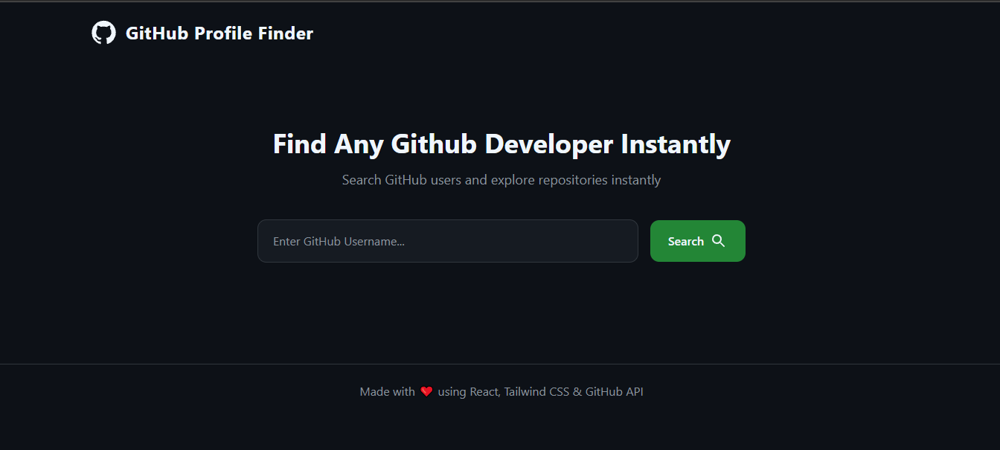
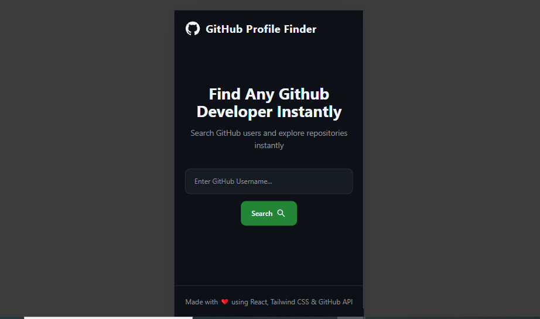

# 🚀 GitHub Profile Finder

A modern and responsive **GitHub Profile Finder** built with **React.js**, **Tailwind CSS**, **Material UI**, and the **GitHub REST API**.

Search any GitHub username and instantly view profile details, repository statistics, and repositories.

---

## 📸 Screenshots

### Desktop View




### Mobile View



---

## ✨ Features

- 🔍 Search any GitHub username
- 👤 Display profile information
- 📍 Show location, bio and company
- 👥 Followers & Following count
- 📦 Public repositories
- ⭐ Repository stars
- 💻 Repository language
- 🔗 Open GitHub profile in a new tab
- 📱 Fully responsive design
- ⏳ Loading state
- ⚠️ Error handling for invalid usernames

---

## 🛠️ Tech Stack

- React.js
- Tailwind CSS
- Material UI
- Axios
- GitHub REST API
- Vite

---

## 📂 Folder Structure

```text
src
│
├── api
│   └── githubApi.js
│
├── components
│   ├── Navbar.jsx
│   ├── SearchBar.jsx
│   ├── ProfileCard.jsx
│   ├── Stats.jsx
│   ├── RepoCard.jsx
│   └── Footer.jsx
│
├── pages
│   └── Home.jsx
│
├── App.jsx
└── main.jsx
```

---

## 🚀 Installation

Clone the repository

```bash
git clone https://github.com/Vibha2407/github-profile-finder.git
```

Go to the project folder

```bash
cd github-profile-finder
```

Install dependencies

```bash
npm install
```

Run the development server

```bash
npm run dev
```

---

## 📡 API Used

### User Profile

```text
GET https://api.github.com/users/{username}
```

### User Repositories

```text
GET https://api.github.com/users/{username}/repos
```

---

## 📚 What I Learned

During this project I practiced:

- React Components
- Props
- useState Hook
- Conditional Rendering
- API Integration using Axios
- Async / Await
- Error Handling
- Responsive UI Design
- GitHub REST API

---

## 🔮 Future Improvements

- 🌙 Dark Mode
- ❤️ Favorite Developers
- 📜 Search History
- 🔎 Repository Filtering
- 📊 Repository Sorting
- 🤖 AI GitHub Profile Analysis

---

## 👩‍💻 Author

**Vibha Vishwakarma**

GitHub: https://github.com/Vibha2407

---

⭐ If you found this project helpful, please give it a star!
